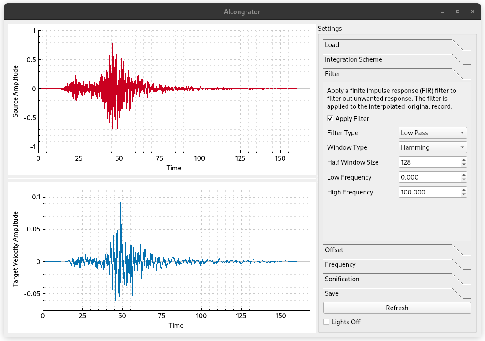

#  [Al]gorithmic [Con]sistency Inte[grator]

**Alcongrator** is a utility to generate ground motion history based on given records.

Currently, it supports:

1. Generate displacement, velocity and acceleration from given displacement/velocity/acceleration records.
2. Integrate the response using the following time integration methods:
    - Newmark,
    - Bathe Two Step,
    - Generalised Alpha,
    - GSSSS (General Single Step Single Solve).
3. DFT with filters.
4. Listen to the ground motion.
5. Over- and under-sampling with cubic spline interpolation.

## To Compile

### Prerequisites

Please install [Qt 6](https://doc.qt.io/qt-6). [OpenBLAS](https://github.com/xianyi/OpenBLAS) is
used as the linear algebra driver. The bundled build (under `lib/`) may not be optimal on your machine, replace it with
your version if necessary.

#### Linux

Nothing needs to be noted.

#### Windows

Install [Qt 6](https://doc.qt.io/qt-6). Configure with CMake.

Alternatively, download and install [Visual Studio 2019](https://visualstudio.microsoft.com/vs/older-downloads/) if you
wish to use MSVC platform.

## Dependencies

The dark theme is taken from [TeXstudio](https://github.com/texstudio-org/texstudio) project.

1. [Qt](https://doc.qt.io/qt-6/index.html)
2. [Armadillo](http://arma.sourceforge.net/docs.html)
3. [OpenBLAS](https://github.com/xianyi/OpenBLAS)
4. [QCustomPlot](https://www.qcustomplot.com/)
5. [SuperLU](https://portal.nersc.gov/project/sparse/superlu/)
